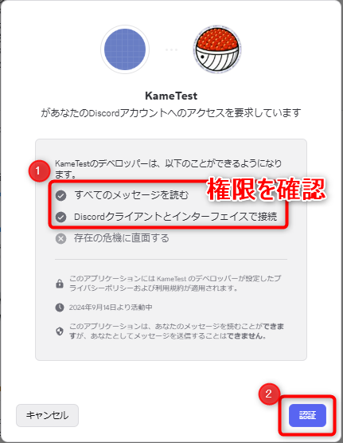

# Discord RPC メッセージ取得ツール

このツールは、Discord RPCを使用して特定のチャンネルのメッセージを取得し、テキストファイルとして保存するCLIツールです。  
主に、Cursorでの会話返答生成のために使用することを想定しています。

## 主なユースケース

### CursorなどのAIツールでの会話返答生成
- Discordの会話履歴を取得し、Cursorでの返答生成の参考資料として活用
- 過去50件のメッセージを取得できるため、過去の会話を理解した上で、より適切な返答を生成できる
    - (コンテキストメニューを使用したBOTだと、過去1件のメッセージしか取得できないため、RPCを使う利点があります。)

## 機能

- Discord RPCを使用したメッセージ取得
    - 手動でDiscordから全文をコピペする必要はありません。
- チャンネルIDを入力するだけで、メッセージを取得できる
    - サーバーだけでなく、DMチャンネルも取得できます。
    - 一度入力すれば、あとはEnterを押すだけで最新のメッセージを取得しなおすことができます。
- メッセージのテキストファイルへの保存
    - Cursorですぐにメッセージを参照できます。

## 必要条件

- Node.js (v16以上)
- Discordデスクトップアプリ
    - RPCを使うため、Web版では動作しません。
- Discord Developer Portalで作成したアプリケーション

## セットアップ

1. リポジトリをクローン
    ```bash
    git clone https://github.com/Kamesuta/discord-rpc-message-fetcher.git
    cd discord-rpc-message-fetcher
    ```

2. 依存関係のインストール
    ```bash
    npm install
    ```

3. Discord Developer Portalでアプリケーションを作成
    - [discord.dev](https://discord.dev) にアクセスして、「New Application」からアプリケーションを作成します。
    - 作成したアプリケーションの「OAuth2」タブを開きます。
        - 「Client ID」をコピーします。
        - 「Reset Secret」を押して、クライアントシークレットを取得します。
    - (重要) 「Redirects」に `http://localhost` を追加します。

4. 環境変数の設定
    `.env`ファイルを作成し、以下の内容を設定します：
    ```
    # DiscordアプリケーションのクライアントID
    # Discord Developer Portalの「OAuth2」タブから取得できます
    DISCORD_CLIENT_ID=your_client_id_here

    # Discordアプリケーションのクライアントシークレット
    # Discord Developer Portalの「OAuth2」タブから取得できます
    DISCORD_CLIENT_SECRET=your_client_secret_here
    ```
    
    `your_client_id_here`と`your_client_secret_here`を、Discord Developer Portalで取得した実際の値に置き換えてください。

## 使用方法

1. あらかじめDiscordデスクトップアプリを起動しておく

2. プログラムの実行
    ```bash
    npm start
    ```

3. Discordデスクトップアプリに認可を要求するダイアログが表示されるので、権限を確認した上で「認証」をクリックします。  
    

4. チャンネルIDの入力
    - 取得したいチャンネルのIDを入力します
        - チャンネルIDは、Discordの開発者モードを有効にした上でチャンネル(またはDM)を右クリックして「チャンネルIDをコピー」を選択することで取得できます。
    - 次回以降は、前回入力したチャンネルIDがデフォルト値として表示されます
    - Enterキーを押すだけで、同じチャンネルのメッセージを再取得できます
    - 新しいチャンネルIDを入力すると、そのチャンネルのメッセージを取得します

5. メッセージの保存
    - 取得したメッセージは`messages_[チャンネルID].txt`として保存されます
    - メッセージには、タイムスタンプ、ユーザー名、メッセージ内容が含まれます

6. AIツールでの活用
    - 保存されたメッセージファイルをCursorなどのAIツールで開き、会話の文脈を要約したり、返事を考えたりしましょう

## 注意事項

- Discordデスクトップアプリ が起動している必要があります
- RPC機能はプライベートβ機能です。
    - 現段階では、自分、又はDiscord開発者ポータルで「App Tester」に招待したユーザーのみが使用できます

## ライセンス

MIT 